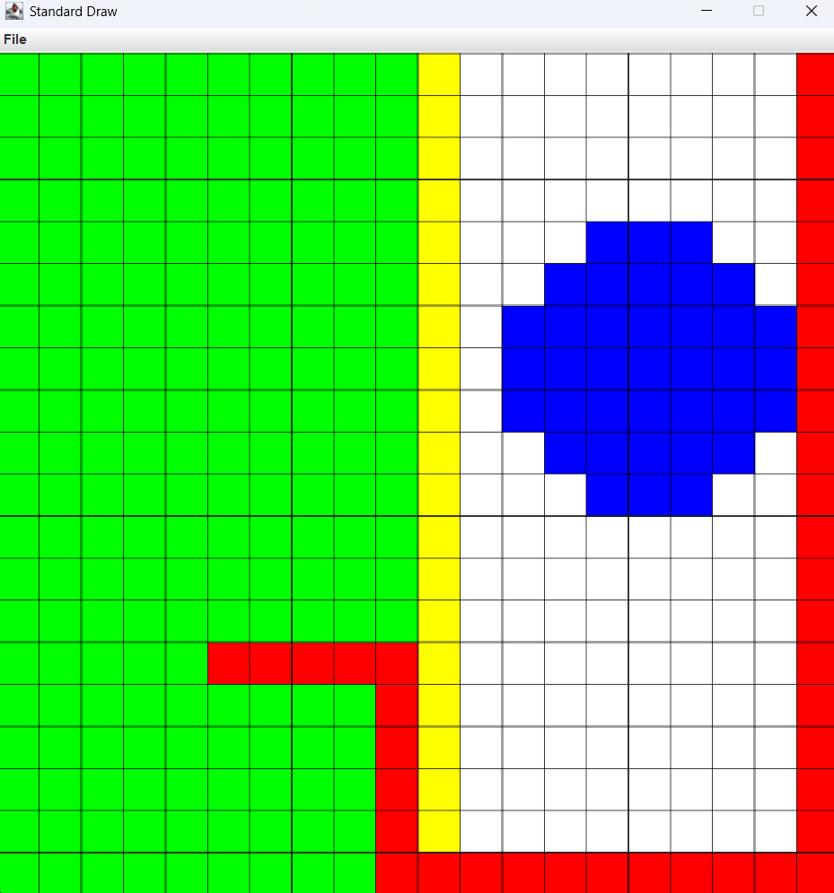

# I2CS_Ex2
This repository contains all files from Ex2 project from introducing for computer science course at Ariel university.

This project is about 2D maps with some functions (shortest path, draw shapes e.t.c), the project includes 2 main Java
classes: Index2D - represent a Pixel , Map - represent a 2D map.

Index2D implements Pixel2D interface and represent a pixel "(x,y)", x represent an X coordinate (or width) y represent 
an Y coordinate (or height). most of the use of this class is for Map class.
this class has basic functions like constructors, getters, toString, equals and a distance function that compute the distance between two pixel.
for more info see the documentations in Pixel2D.java and Index2D.java

Map class implements Map2D interface and represent a 2D map of Pixels (2D Integer array) which every entry have a color (Integer value).
the map have some basic function like constructors , getters and setters.
there some functions for the map like:
1. shortestPath - compute the shortest path between two pixel while avoiding obstacles.
2. allDistance - return a new map which cell (pixel) value is the shortest path to the pixel from a start pixel (while avoiding obstacles).
3. fill - fill the connected component of pixel in the new color (new_v), using flood fill algo. 
4. drawCircle - draw a circle in the map with given center and a radius.
5. drawRect - draw a rectangle in the map with given two pixel as corners.

This is a list of elected functions from this class, for more info and another functions please see the documentations in the Map.java

In the Ex2_GUI.java you can find main that includes some examples for the functions in the map. 

