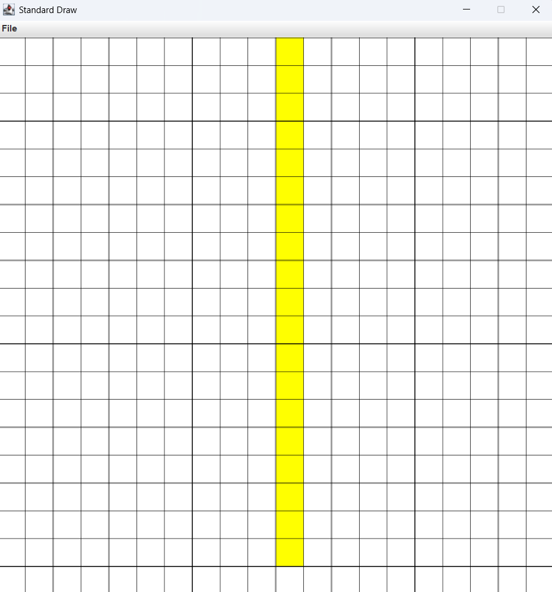
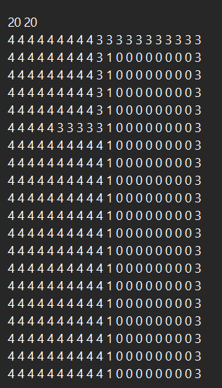

# I2CS_Ex2
This repository contains all files from Ex2 project from introducing for computer science course at Ariel university.

This project is about 2D maps with some functions (shortest path, draw shapes e.t.c), the project includes 2 main Java
classes: Index2D - represent a Pixel , Map - represent a 2D map.

Index2D implements Pixel2D interface and represent a pixel "(x,y)", x represent an X coordinate (or width) y represent 
an Y coordinate (or height). most of the use of this class is for Map class.
this class has basic functions like constructors, getters, toString, equals and a distance function that compute the distance between two pixel.
for more info see the documentations in Pixel2D.java and Index2D.java

Map class implements Map2D interface and represent a 2D map of Pixels (2D Integer array) which every entry have a color (Integer value).
the map have some basic function like constructors , getters and setters.
there some functions for the map like: (some of them have cyclic map option)
1. shortestPath - compute the shortest path between two pixel while avoiding obstacles. 
2. allDistance - return a new map which cell (pixel) value is the shortest path to the pixel from a start pixel (while avoiding obstacles).
3. fill - fill the connected component of pixel in the new color (new_v), using flood fill algo. 
4. drawCircle - draw a circle in the map with given center and a radius.
5. drawRect - draw a rectangle in the map with given two pixel as corners.

This is a list of elected functions from this class, for more info and another functions please see the documentations in the Map.java

In the Ex2_GUI.java you can find main that includes some examples for the functions in the map.
this is an example after running the main:
                                    
                              Start map with obstacle

                        The shortest path(red) between the gray pixels

 between the gray pixels")

                        After fill area with green and draw a blue circle

You can see:
1. The yellow line represent an obstacle, and the red path is the shortest path between the two edges.
2. The green area is a fill option at (0,6) with the color green, its stopped at the obstacle. the red path and the edges of the map (none cyclic map).
3. The blue circle is a drawCircle function with center (15,12) and 3.5 radius

also you can save the map to txt file and load another map from txt file using save and load function from Ex2_GUI.java
at the GUI example before, after the green fill and before the blue circle the program save the map to a txt file and the load it to another map.
the load function need to be used ONLY with the format that given below:
        
    The output to a txt file (and the format is needed to load a map from txt file)

1. in the first line you can the dimensions of the map, the first number represent the width and the second the height.
2. after that is the data of the map which it upside down (the first line is the pixel which width =0 and so on), the right and left are sync.